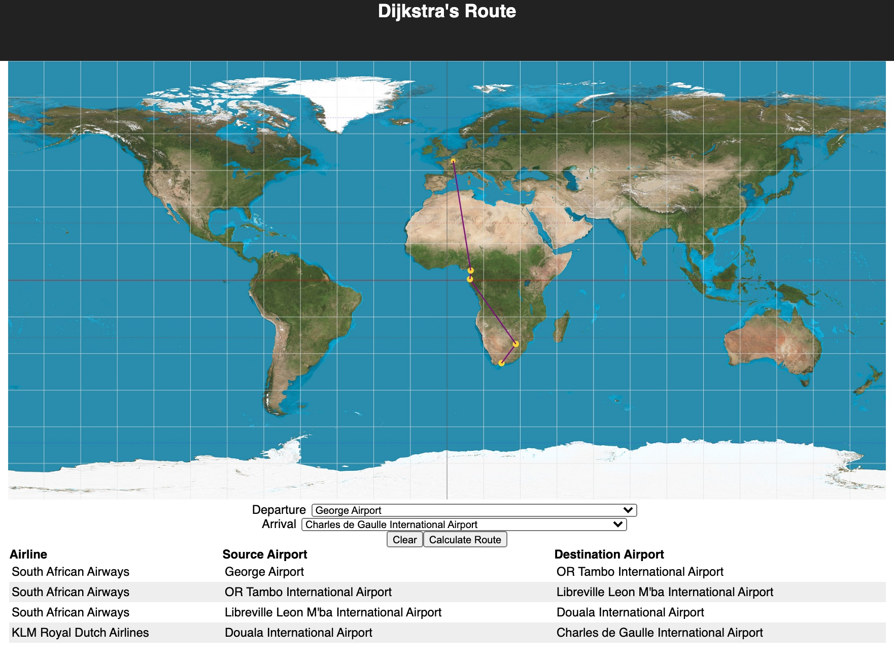

# React-Airlines

**React-Airlines** is an app that allows the user to filter and display various airline routes around the world.

Available routes may be filtered by Airline or by the starting or ending location of the route.  Clicking on the map will filter the routes by airport and display the available routes on the map.

The data used for creating routes is static and non-exhaustive.

This App was built with React and deployed on [Heroku](https://whispering-tor-12498.herokuapp.com/)
